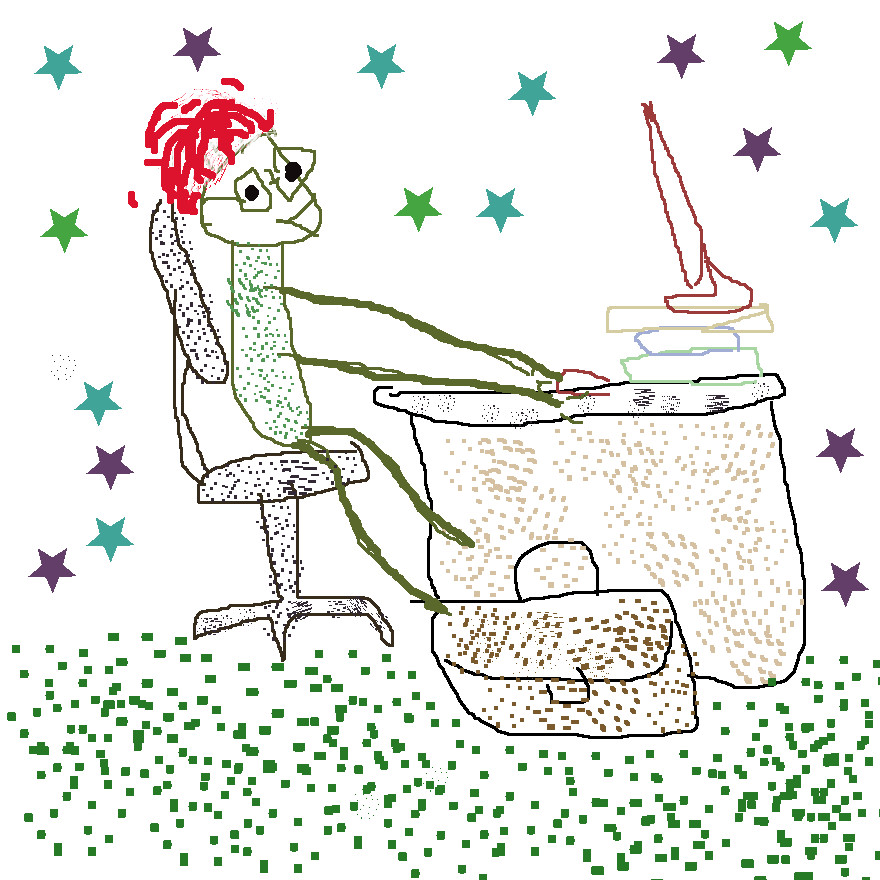

# Hey Buddy

### I'm arash, computer stuff lover

- Python Coder
- Sys Admin
- Back-End Developer (learning Django)
- **Jadi lover** (Unfortunately :) i love this crazzy man)
- PHP coder (i was, no php anymore)
- Bash scripter
- VHDL coder
- Vim lover, even its ext. on firefox
- sometimes i do Design stuff :neutral_face: like painting, but i did more, if i had talent :)
   
   

### I know:

Of course i know more :neutral_face::unamused::roll_eyes: this is just a short icon list.

### My Stats

### My Language

Don't get this serios :|

<b>Email :</b>

- (arash.ph17@gmail.com)

