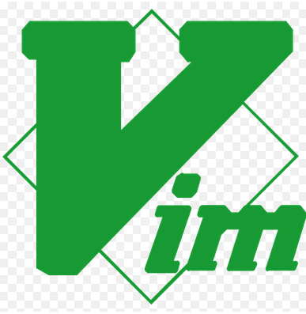

# Hey Buddy

### I'm AmirHosein
I’m a Computer Engineering graduate from Hamedan University of Technology, passionate about WebApp Security and WebApp development. I enjoy working with Linux systems and building automation solutions using Python and Bash.
I’m driven by curiosity and problem-solving — always eager to learn, improve, and take on new challenges. My patience, adaptability, and leadership skills help me perform effectively both independently and as part of a collaborative team.
   

### I know:

Of course i know more :neutral_face::unamused::roll_eyes: this is just a short icon list.

### My Stats

### My Language

Don't get this serios :|

## contact me:
<b>Email:</b> ‫‪ahghanbari@protonmail.com

<b>LinkedIn:</b> https://www.linkedin.com/in/ahghanbari/

